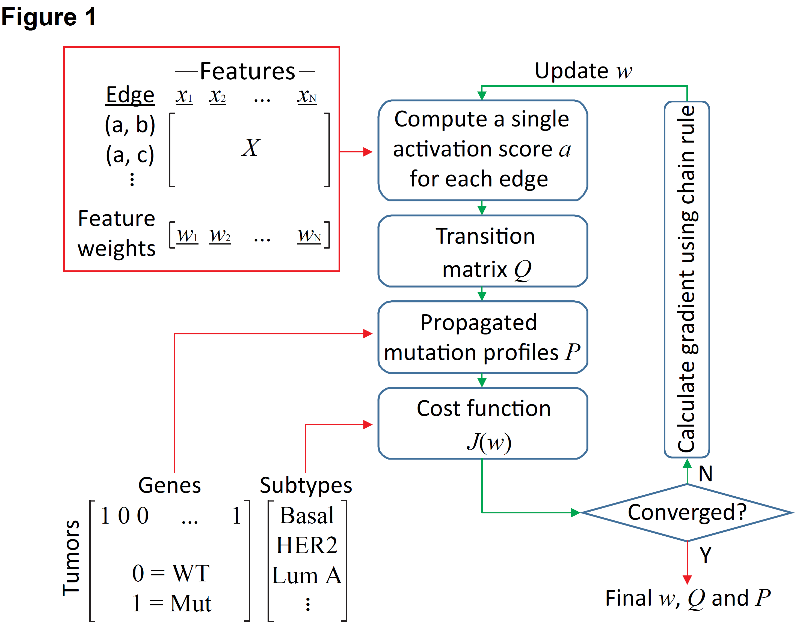
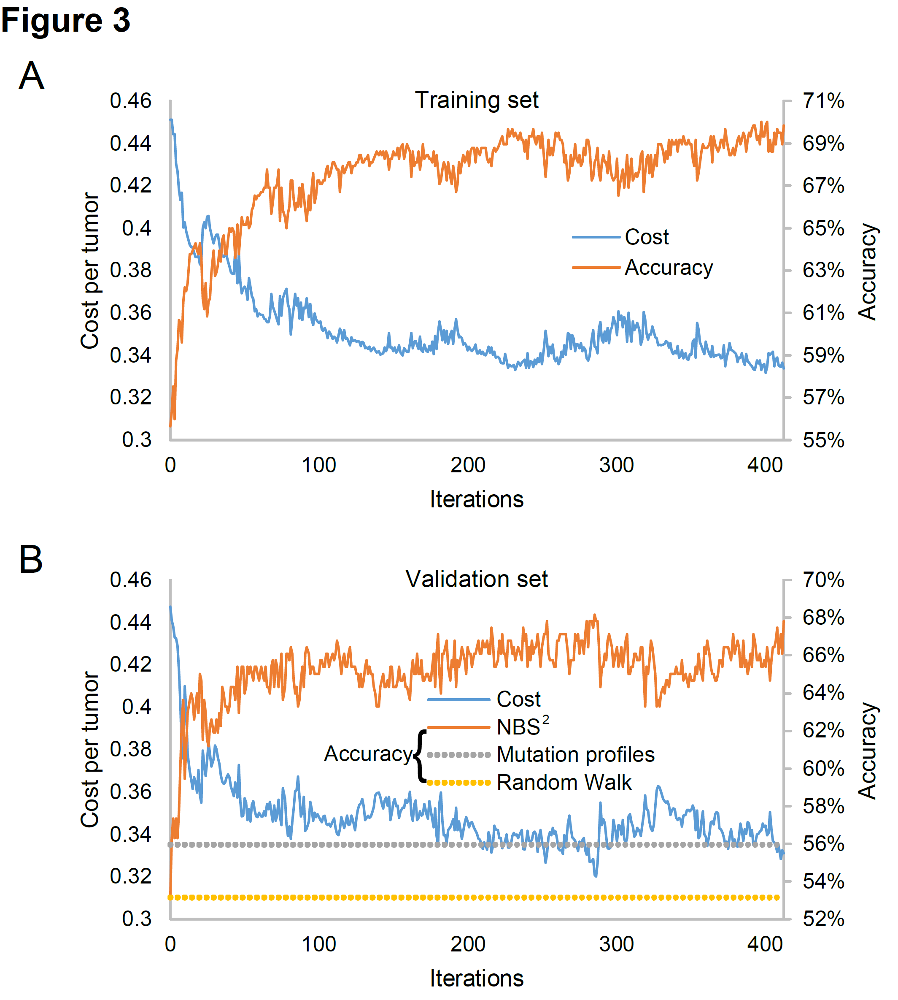

# Feature Pathways Extraction using Supervised Random Walk with Restart  

## Abstract

__Methods:__ We're using a supervised random walk with  restart to partition samples and mining underlying feature pathways underlying sample group.

__Results:__ We run this framework on BRCA's data and find it have great performance.  
​    
## The package

* [__FPE_SRWR__](./FPE_SRWR/FPE_SRWR.py) This software package contains all the functions of FPE_SRWR.  
* [__pypi__](https://pypi.org/project/FPE-SRWR/0.0.1/#files) Users can use command line 'pip install FPE-SRWR==0.0.1' to download this package.
## Analysis scripts

* [__BRCA_example__](./BRCA_example/BRCA_example.ipynb) Run the package to group samples and mining feature pathways.   
## Figures

| |
|----|
|  |
| **Fig. 1. Framework of FPE_SRWR.** |
|  |
| **Fig. 2. Performance of breast cancer subtypes classification.** |

